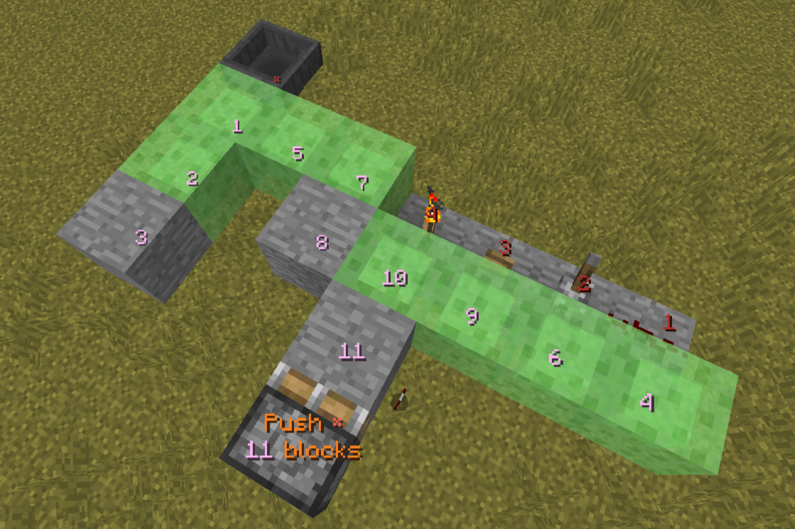

## Pistorder-Legacy 1.12.2

Fork from [FallenBreath-Pistorder](https://github.com/Fallen-Breath/pistorder/tree/master)

Make it work on 1.12.2 with [Ornithe](https://ornithemc.net/)

A mod that shows the block movement order of a piston. Thanks [CarpetClient](https://github.com/X-com/CarpetClient) for the idea of such a cool tool

Right click a piston base block with an empty hand to show what will happen when a piston pushes / retracts

Nothing will happen if you are sneaking when clicking

It will show:
- If the piston action will success. A `√` or a `×` indicates the result
- The amount of the block that will get moved by the piston (even when it exceeds the piston push limit, maximum 128 blocks)
- The push order of the blocks to be moved
- The push order of the blocks to be destroyed
- The immovable block that cause push failure if presents

Information will still be displayed if the piston fails to push / retract, but if it fails due to an in-movable block the result might be incorrect

Click the piston again to hide the information display. Information displays will also be removed after a dimension change 

If there is an air gap between the piston and a block, clicking again will switch into indirect mode. It will assume the piston is interacting with the block and show the related push / retract information

Press the clear hot key (default `v`) to remove all information display manually

